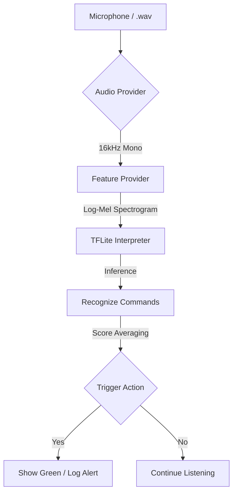

# Hey ThinkPad - Modern Micro-Speech Detection


A modernized TensorFlow 2.x implementation for Keyword Spotting (KWS), specifically optimized to detect the phrase **"Hey ThinkPad"**. This project bridges the gap between high-level Python prototyping and low-level C++ production deployment.

## 🚀 Overview

This repository replaces the deprecated TensorFlow 1.15 methods (e.g., `toco`, `tiny_conv`) found in the original `Micro-Speech` examples with a streamlined, Python-native pipeline utilizing **Keras**, **librosa**, and **TFLiteConverter**.

### Core Improvements:
- **Python-Native Pipeline**: No more TF 1.15 dependencies. Uses Keras 3.x and modern TFLite APIs.
- **1.5s Audio Window**: Optimized for multi-word phrases like "Hey ThinkPad" (expanded from the standard 1.0s).
- **Dual-Engine Support**:
    - **Python GUI**: For rapid testing, visualization, and dataset refinement.
    - **Native C++**: For ultra-low latency and standalone Windows/Embedded execution.
- **Data-First Workflow**: Built-in augmentation and synthetic dataset generation.

---

## 🏗️ System Architecture

The project follows a standard Digital Signal Processing (DSP) to Deep Learning (DL) pipeline.



> [!NOTE]
> **Processing Diff**: The Python version uses `librosa` for real-time FFT, while the C++ version utilizes a custom `micro_features` implementation for embedded efficiency.

---

## 📂 Project Structure Map

| Folder | Purpose |
| :--- | :--- |
| `app/` | **Windows GUI Application** (Tkinter + Sounddevice). |
| `src/` | **Core Python Logic** (Training, Augmentation, Inference). |
| `scripts/` | **Automation Scripts** (Windows/C++ environment setup). |
| `artifacts/` | **Output Directory** for trained models (`.tflite`) and labels. |
| `data/` | **Dataset Store** (Raw, Augmented, and Background noise). |
| `arduino/` | **Embedded Deployment** source for Arduino-compatible boards. |
| `micro_features/` | Optimized C++ FFT implementation for TFLite Micro. |

---

## 🚦 Quick Start (Python)

### 1. Initialize Environment
Open PowerShell and run the automated setup script:
```powershell
.\scripts\setup_windows.ps1
```
This creates a `.venv`, activates it, and installs all required dependencies.

### 2. Run the Live Monitor
To see the wake-word detection in action immediately (using the pre-trained model):
```powershell
python app/main.py
```

---

## 🧪 Data & Training Workflow

If you want to train the model for your own voice or a different phrase:

1. **Prepare Initial Data**:
   ```powershell
   python src/prepare_dataset.py
   ```
2. **Augment Data**: Generate thousands of variations (pitch, noise, shift):
   ```powershell
   python src/augment_audio.py --input data/train --output-dir data/augmented --num-aug 5 --dataset-mode
   ```
3. **Train**:
   ```powershell
   python src/train.py
   ```
   *Result: New `artifacts/model.tflite` is generated.*

---

## 💻 Native C++ Build (Windows)

For maximum performance and zero Python dependency, build the standalone Win32 application.

### Prerequisites
- **Visual Studio 2022** (with "C++ Desktop Development").
- **CMake**.

### Build Steps
1. **Download TFLite Libraries**:
   ```powershell
   .\scripts\setup_cpp_env.ps1
   ```
2. **Compile**:
   ```powershell
   cmake -B build
   cmake --build build --config Release
   ```
3. **Run**:
   ```powershell
   .\build\Release\HeyThinkPad.exe
   ```

---

## 🛠️ Technical Specifications

- **Sampling Rate**: 16,000 Hz (Mono)
- **Window Size**: 1,500 ms (24,000 samples)
- **Preprocessing**: 40-band Mel Spectrogram
- **Model**: CNN with Depthwise Separable Convolutions
- **Input Shape**: `(1, 49, 40, 1)` (Batch, Time, Frequency, Channel)

---

## ❓ Troubleshooting & FAQ

> [!TIP]
> **No Audio Device Found?** Ensure your microphone is set as the "Default Recording Device" in Windows Settings. The app uses `sounddevice`, which relies on the PortAudio backend.

**Q: The app starts but doesn't detect anything.**
- A: Check the `artifacts/labels.txt`. Ensure "yes" is one of the labels. "yes" represents the wake word in this project.

**Q: C++ Build fails with "Missing Header" errors.**
- A: Run `.\scripts\setup_cpp_env.ps1` again. It fetches the necessary TFLite C-API headers which are not bundled with the repo.

**Q: Performance is slow on my laptop.**
- A: The Python version is for rapid iteration. For production use, always use the **Native C++ version**, which is ~5x more efficient.

---

## 📜 License
*Licensed under the Apache License, Version 2.0. Portions of this code are derived from the TensorFlow Lite Micro Speech Example.*
