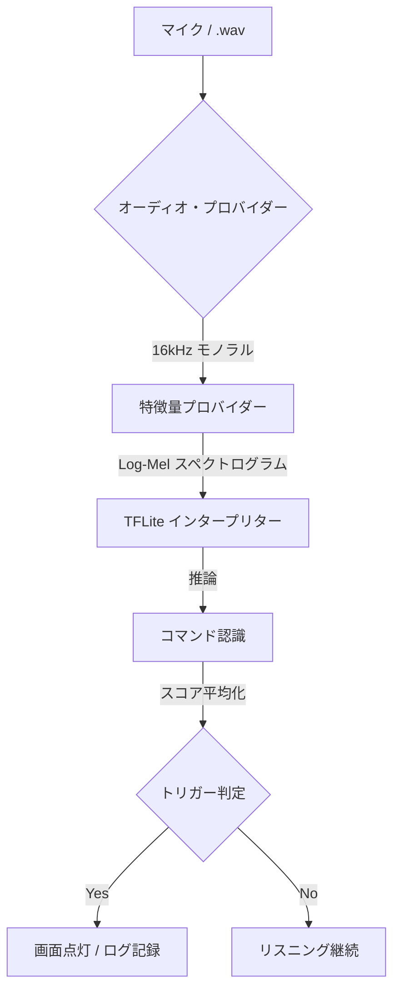

# Hey ThinkPad - Modern Micro-Speech Detection

[English](README.md) | [日本語](README_JA.md) | [简体中文](README_ZH.md)


Keyword Spotting (KWS)のためのモダンな TensorFlow 2.x 実装です。特に **"Hey ThinkPad"** というフレーズを検出するために最適化されています。このプロジェクトは、ハイレベルな Python プロトタイピングとローレベルな C++ プロダクション・デプロイメントの架け橋となります。

## 🚀 概要

このリポジトリは、オリジナルの `Micro-Speech` サンプルに含まれていた古い TensorFlow 1.15 の手法（`toco` や `tiny_conv` など）を、**Keras**、**librosa**、**TFLiteConverter** を活用した効率的な Python ネイティブ・パイプラインに置き換えたものです。

### 主な改善点

- **Python ネイティブ パイプライン**: TF 1.15 への依存を排除。Keras 3.x と最新の TFLite API を使用。
- **1.5秒のオーディオウィンドウ**: "Hey ThinkPad" のような複数の単語からなるフレーズ向けに最適化（標準の1.0秒から拡張）。
- **デュアルエンジンをサポート**
  - **Python GUI**: 迅速なテスト、視覚化、データセットの精緻化用。
  - **ネイティブ C++**: 超低遅延な Windows または埋め込み実行用。
- **データファースト・ワークフロー**: データ拡張（Augmentation）と擬似データセット生成機能を内蔵。

---

## 🏗️ システム構成

このプロジェクトは、標準的なデジタル信号処理（DSP）からディープラーニング（DL）へのパイプラインに従います。



> [!NOTE]
> **処理の違い**: Python 版はリアルタイム FFT に `librosa` を使用しますが、C++ 版は埋め込み環境での効率化のためにカスタムされた `micro_features` 実装を使用します。

---

## 📂 プロジェクト構造

| フォルダ | 用途 |
| :--- | :--- |
| `app/` | **Windows GUI アプリケーション** (Tkinter + Sounddevice)。 |
| `src/` | **コア Python ロジック** (学習、データ拡張、推論)。 |
| `scripts/` | **自動化スクリプト** (Windows/C++ 環境セットアップ)。 |
| `artifacts/` | 学習済みモデル (`.tflite`) とラベルの**出力先**。 |
| `data/` | **データセット保存先** (生データ、拡張データ、背景ノイズ)。 |
| `arduino/` | Arduino互換ボード向けの**埋め込みデプロイ用**ソース。 |
| `micro_features/` | TFLite Micro 向けに最適化された C++ FFT 実装。 |

---

## 📂 詳細コンポーネント解説

### 🐍 Pythonスクリプト (`src/`)

モデルの学習、評価、データの拡張を担当します。

- **`prepare_dataset.py`**: パイプライン・テスト用のダミーデータ生成
  - **役割**: サイン波とノイズを組み合わせた擬似音声ファイルを生成し、学習フローが正しく動作するか確認するために使用します。
  - **使い方**: `python src/prepare_dataset.py`
- **`augment_audio.py`**: データ拡張（Augmentation）ツール
  - **役割**: 少量の録音データから数千のバリエーション（ピッチ変更、ノイズ追加、時間シフト等）を生成し、モデルの堅牢性を高めます。
  - **主要引数**: `--input` (入力元), `--output-dir` (出力先), `--num-aug` (1ファイルあたりの生成数)
- **`train.py`**: モデル学習とTFLite出力
  - **役割**: 音声データをメル・スペクトログラムに変換し、CNNモデルを学習させます。最終的に量子化された `model.tflite` を出力します。
- **`infer_wav.py`**: 単一WAVファイルの推論テスト
  - **役割**: 特定の音声ファイルに対して、学習済みモデルが正しく判定できるかコマンドラインでテストします。
- **`inspect_audio.py`**: 音声データの統計確認
  - **役割**: 指定したディレクトリ内の全WAVファイルのサンプリングレート、チャンネル数、長さの分布をレポートします。
- **`audio_stream.py` / `live_inference.py`**: リアルタイム推論コア
  - **役割**: マイクからの連続入力をリングバッファで管理し、250msごとにモデルを実行する「推論エンジン」の役割を果たします。

### ⚙️ C++機能抽出 (`micro_features/`)

マイコンやネイティブアプリで、Python版と同じ「音の視覚化（スペクトログラム生成）」を行うための最適化されたコードです。

- **`micro_features_generator.h/cc`**:
  - **API**: `InitializeMicroFeatures()` で初期化し、`GenerateMicroFeatures()` に16bit PCMデータを渡すと、モデル入力用の8bit特徴量に変換します。
- **`micro_model_settings.h`**:
  - **重要**: サンプリングレート(16kHz)や特徴量の次元数(40)などが定義されています。Python側で設定を変更した場合は、ここも合わせて変更して再ビルドする必要があります。

---

## 🚦 クイックスタート (Python)

### 1. 環境の初期化
PowerShell を開き、自動セットアップスクリプトを実行します。
```powershell
.\scripts\setup_windows.ps1
```
これにより `.venv` が作成・有効化され、必要な依存関係がすべてインストールされます。

### 2. ライブモニタの実行
（学習済みモデルを使用して）すぐに動作を確認する場合：
```powershell
python app/main.py
```

---

## 🧪 データ準備と学習ワークフロー

独自の音声や異なるフレーズでモデルを学習させたい場合：

1. **初期データの準備**:
   ```powershell
   python src/prepare_dataset.py
   ```
2. **データの拡張**: 数千のバリエーション（ピッチ、ノイズ、シフト）を生成します。
   ```powershell
   python src/augment_audio.py --input data/train --output-dir data/augmented --num-aug 5 --dataset-mode
   ```
3. **学習**:
   ```powershell
   python src/train.py
   ```
   *結果: 新しい `artifacts/model.tflite` が生成されます。*

---

## 💻 ネイティブ C++ ビルド (Windows)

最高のパフォーマンスと Python への依存をゼロにするには、スタンドアロンの Win32 アプリケーションをビルドします。

### 前提条件
- **Visual Studio 2022** ("C++ によるデスクトップ開発" を含む)。
- **CMake**。

### ビルド手順
1. **TFLite ライブラリのダウンロード**:
   ```powershell
   .\scripts\setup_cpp_env.ps1
   ```
2. **コンパイル**:
   ```powershell
   cmake -B build
   cmake --build build --config Release
   ```
3. **実行**:
   ```powershell
   .\build\Release\HeyThinkPad.exe
   ```

---

## 🛠️ 技術仕様

- **サンプリングレート**: 16,000 Hz (モノラル)
- **ウィンドウサイズ**: 1,500 ms (24,000 サンプル)
- **前処理**: 40バンド メル・スペクトログラム
- **モデル**: 深さ方向分離可能畳み込み（Depthwise Separable Convolutions）を用いた CNN
- **入力シェイプ**: `(1, 49, 40, 1)` (Batch, Time, Frequency, Channel)

---

## ❓ トラブルシューティング & FAQ

> [!TIP]
> **オーディオ・デバイスが見つかりませんか？** Windows の設定でマイクが「既定の録音デバイス」に設定されていることを確認してください。

**Q: アプリは起動しますが、何も検出されません。**
- A: `artifacts/labels.txt` を確認してください。"yes" というラベルが含まれていることを確認してください。このプロジェクトでは "yes" がウェイクワードを表します。

**Q: C++ のビルドが「ヘッダーが見つかりません」というエラーで失敗します。**
- A: `.\scripts\setup_cpp_env.ps1` を再度実行してください。リポジトリに含まれていない必要な TFLite C-API ヘッダーを取得します。

**Q: ノート PC でのパフォーマンスが遅いです。**
- A: Python 版は迅速なイテレーション用です。本番利用や低負荷を求める場合は、常に **ネイティブ C++ 版** を使用してください。

---

## 📜 ライセンス
*Apache License, Version 2.0 の下でライセンスされています。このコードの一部は、TensorFlow Lite Micro Speech サンプルに由来しています。*
