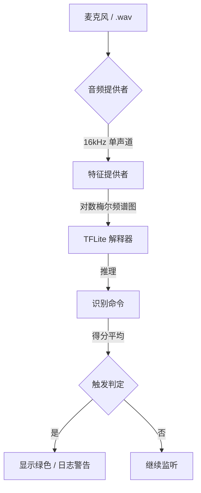

# Hey ThinkPad - 现代微型语音检测

[English](README.md) | [日本語](README_JA.md) | [简体中文](README_ZH.md)


这是一个基于 TensorFlow 2.x 的现代化关键词检测 (KWS) 实现，专门针对 **"Hey ThinkPad"** 这一短语进行了优化。该项目填补了高级 Python 原型设计与低级 C++ 生产部署之间的空白。

## 🚀 概述

本仓库取代了原始 `Micro-Speech` 示例中已弃用的 TensorFlow 1.15 方法（例如 `toco`、`tiny_conv`），采用了基于 **Keras**、**librosa** 和 **TFLiteConverter** 的流线型 Python 原生管道。

### 核心改进

- **Python 原生管道**: 不再依赖 TF 1.15。使用 Keras 3.x 和现代 TFLite API。
- **1.5秒音频窗口**: 针对 "Hey ThinkPad" 等多词短语进行了优化（从标准的 1.0 秒扩展）。
- **双引擎支持**
  - **Python GUI**: 用于快速测试、可视化和数据集精炼。
  - **原生 C++**: 用于超低延迟、独立运行的 Windows 或嵌入式执行。
- **数据优先工作流**: 内置数据增强 (Augmentation) 和合成数据集生成功能。

---

## 🏗️ 系统架构

该项目遵循标准的数字信号处理 (DSP) 到深度学习 (DL) 管道。



> [!NOTE]
> **处理差异**: Python 版本使用 `librosa` 进行实时 FFT，而 C++ 版本则为了嵌入式效率使用了自定义的 `micro_features` 实现。

---

## 📂 项目结构

| 文件夹 | 用途 |
| :--- | :--- |
| `app/` | **Windows GUI 应用程序** (Tkinter + Sounddevice)。 |
| `src/` | **核心 Python 逻辑** (训练、数据增强、推理)。 |
| `scripts/` | **自动化脚本** (Windows/C++ 环境设置)。 |
| `artifacts/` | 训练模型 (`.tflite`) 和标签的**输出目录**。 |
| `data/` | **数据集存储** (原始数据、增强数据、背景噪音)。 |
| `arduino/` | 兼容 Arduino 开发板的**嵌入式部署**源码。 |
| `micro_features/` | 针对 TFLite Micro 优化的 C++ FFT 实现。 |

---

## 📂 详细组件说明

### 🐍 Python 脚本 (`src/`)

负责模型训练、评估和数据增强。

- **`prepare_dataset.py`**: 管道测试用的模拟数据生成
  - **作用**: 生成混合正弦波和噪音的虚拟音频文件，用于验证训练流程是否正确运行。
  - **用法**: `python src/prepare_dataset.py`
- **`augment_audio.py`**: 音频数据增强工具
  - **作用**: 通过对少量录音数据进行变调、加噪、偏移等处理，生成数千个变体，增强模型的鲁棒性。
  - **主要参数**: `--input` (输入), `--output-dir` (输出), `--num-aug` (每个文件的生成数量)
- **`train.py`**: 模型训练与 TFLite 导出
  - **作用**: 将音频转换为梅尔频谱图，训练 CNN 模型，并导出量化后的 `model.tflite`。
- **`infer_wav.py`**: 单个 WAV 文件推理测试
  - **作用**: 使用命令行对特定音频文件进行模型判定测试。
- **`inspect_audio.py`**: 音频数据统计检查
  - **作用**: 扫描指定目录，报告所有 WAV 文件的采样率、通道数和时长分布。
- **`audio_stream.py` / `live_inference.py`**: 实时推理核心
  - **作用**: 使用环形缓冲区管理麦克风连续输入，每 250ms 执行一次模型，作为「推理引擎」。

### ⚙️ C++ 特征提取 (`micro_features/`)

针对单片机或原生应用优化的代码，实现与 Python 版相同的「声音可视化（频谱图生成）」。

- **`micro_features_generator.h/cc`**:
  - **API**: 通过 `InitializeMicroFeatures()` 初始化，调用 `GenerateMicroFeatures()` 即可将 16bit PCM 数据转换为模型所需的 8bit 特征向量。
- **`micro_model_settings.h`**:
  - **重要**: 定义了采样率 (16kHz) 和特征维度 (40) 等常量。如果在 Python 端修改了配置，必须同步更新此处并重新编译。

---

## 🚦 快速开始 (Python)

### 1. 初始化环境
打开 PowerShell 并运行自动设置脚本：
```powershell
.\scripts\setup_windows.ps1
```
这将创建并激活 `.venv`，并安装所有必需依赖。

### 2. 运行实时监控
（使用预训练模型）立即看效果：
```powershell
python app/main.py
```

---

## 🧪 数据准备与训练工作流

如果你想训练自己的声音或不同的短语：

1. **准备初始数据**:
   ```powershell
   python src/prepare_dataset.py
   ```
2. **增强数据**: 生成数千个变体（音高、噪音、偏移）：
   ```powershell
   python src/augment_audio.py --input data/train --output-dir data/augmented --num-aug 5 --dataset-mode
   ```
3. **训练**:
   ```powershell
   python src/train.py
   ```
   *结果: 生成新的 `artifacts/model.tflite`。*

---

## 💻 原生 C++ 构建 (Windows)

为了获得最高性能和零 Python 依赖，可以构建独立的 Win32 应用程序。

### 前提条件
- **Visual Studio 2022** (包含 "使用 C++ 的桌面开发")。
- **CMake**。

### 构建步骤
1. **下载 TFLite 库**:
   ```powershell
   .\scripts\setup_cpp_env.ps1
   ```
2. **编译**:
   ```powershell
   cmake -B build
   cmake --build build --config Release
   ```
3. **运行**:
   ```powershell
   .\build\Release\HeyThinkPad.exe
   ```

---

## 🛠️ 技术规格

- **采样率**: 16,000 Hz (单声道)
- **窗口大小**: 1,500 ms (24,000 个采样点)
- **预处理**: 40 频段梅尔频谱图 (Mel Spectrogram)
- **模型**: 使用深度可分离卷积 (Depthwise Separable Convolutions) 的 CNN
- **输入维度**: `(1, 49, 40, 1)` (Batch, Time, Frequency, Channel)

---

## ❓ 常见问题集 (FAQ)

> [!TIP]
> **找不到音频设备？** 确保您的麦克风已在 Windows 设置中设为「默认录制设备」。

**问：程序启动了但没有检测到任何内容。**
- 答：请检查 `artifacts/labels.txt`。确保包含 "yes" 标签。在这个项目中，"yes" 代表唤醒词。

**问：C++ 构建失败，提示「缺少头文件」。**
- 答：请重新运行 `.\scripts\setup_cpp_env.ps1`。它会获取未包含在仓库中的 TFLite C-API 头文件。

**问：笔记本运行速度很慢。**
- 答：Python 版用于快速迭代。对于生产使用或低负载场景，请务必使用 **原生 C++ 版本**，其效率高出约 5 倍。

---

## 📜 许可证
*本项目采用 Apache License, Version 2.0 授权。部分代码源于 TensorFlow Lite Micro Speech 示例。*
